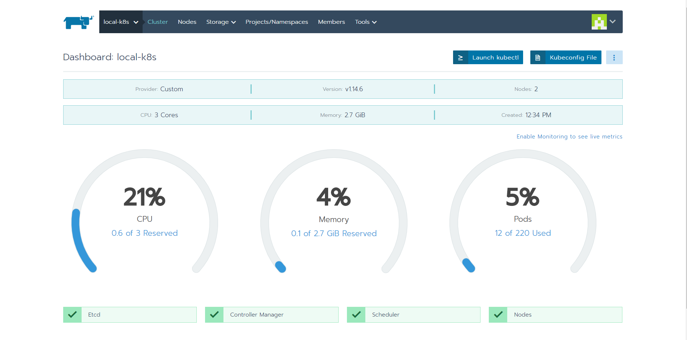

### Local K8s Cluster with Single-node Rancher Server
* 1 x Rancher Server (RancherOS v1.5.4/Docker v18.09.8, 1 vCPU/4GB vMem)
* 1 x K8s Master Node (RancherOS v1.5.4/Docker v18.09.8, 2 vCPU/2GB vMem)
* 1 x K8s Worker Node (RancherOS v1.5.4/Docker v18.09.8, 1 vCPU/1GB vMem)

#### Prerequisites
* VirtualBox
* docker-machine

#### Step 1: Bring up Rancher Server
##### on Local
```bash
$ docker-machine create -d virtualbox \
--virtualbox-boot2docker-url https://releases.rancher.com/os/latest/rancheros.iso \
--virtualbox-cpu-count "1" \
--virtualbox-memory "4096" \
rancher-machine
$ docker-machine ls #check machine status
```

```bash
$ docker-machine ssh rancher-machine
```
##### in VM
```bash
$ docker -v #check docker version
$ sudo ros os version #check RancherOS version
$ sudo docker run -d --restart=unless-stopped -p 80:80 -p 443:443 rancher/rancher
$ sudo docker ps #check Rancher Service running
```
##### in Browser
Checking `<machine_ip>` from `$docker-machine ip rancer-machine` to connect to `https://<machine_ip>` to set initial password and rancher service URL. 

#### Step 2: Bring up K8s Nodes
##### master node
```
$ docker-machine create -d virtualbox \
--virtualbox-boot2docker-url https://releases.rancher.com/os/latest/rancheros.iso \
--virtualbox-cpu-count "2" \
--virtualbox-memory "2048" \
k8s-master
```
##### worker node
```
$ docker-machine create -d virtualbox \
--virtualbox-boot2docker-url https://releases.rancher.com/os/latest/rancheros.iso \
--virtualbox-cpu-count "1" \
--virtualbox-memory "1024" \
k8s-worker
```

#### Step 3: Create a cluster
Following `add cluster` guide by Rancer web UI to add nodes into a K8s cluster. Note that 
* the role of master node is `etcd` and `control panel`, and the worker node is `worker`.
* have to set the public and internal addresses to each node.



Found Issues:
* the websocket is not working after worker node added